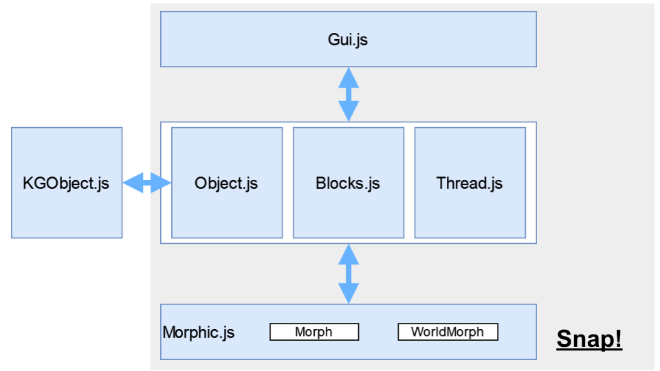

# Knowledge Graphs And Snap

This project proposes an extension of [Snap!](https://snap.berkeley.edu) to create and run SELECT SPARQL queries on Knowledge Graphs. The resulting platform, KGsnap!, is freely available online at https://isislab-unisa.github.io/Snap/snap.html.

The extension is realized by the `KGObjects.js` module, as visible in the architecture visible in the following: 

Examples of KGsnap! in use are reported in the `examples` folder. 

# Local Installation
To install KGSnap! locally, it is necessary to follow the procedure reported below:
- Download a stable version of Snap!, at these links [https://github.com/jmoenig/Snap/releases/latest](https://github.com/jmoenig/Snap/releases/latest "Snap! Source Code "). The module is compatible with versions 8.0 and 8.1
- Copy the `KGObjects.js` file to the Snap! src folder
- Include the `KGObjects.js` module by adding this line to the `snap.html` file:
  ``

At this point, to use Snap! just open the `snap.html` file.

# Dissemination events
- KGsnap! has been presented as a 1-hour workshop at the [Snap!con 2023](https://www.snapcon.org/conferences/2023/program/proposals/623#3). 

- From December 2023 to May 2024, high-school learners in the Campania region used KGsnap! in Data Literacy activities to go beyond tabular data and experience Knowledge Graphs.
