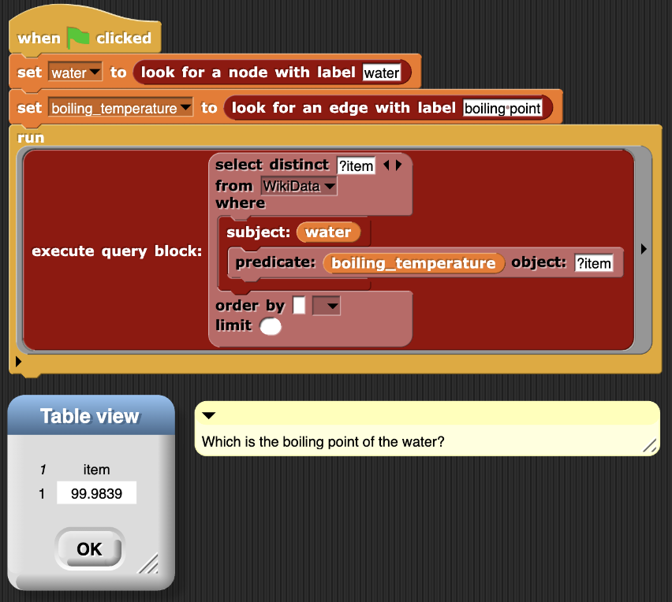
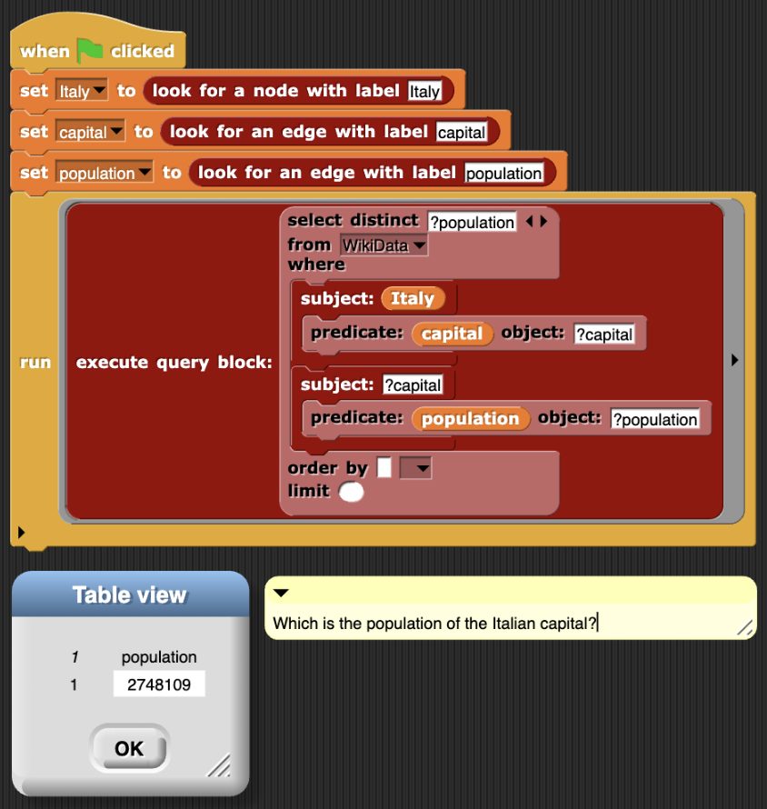
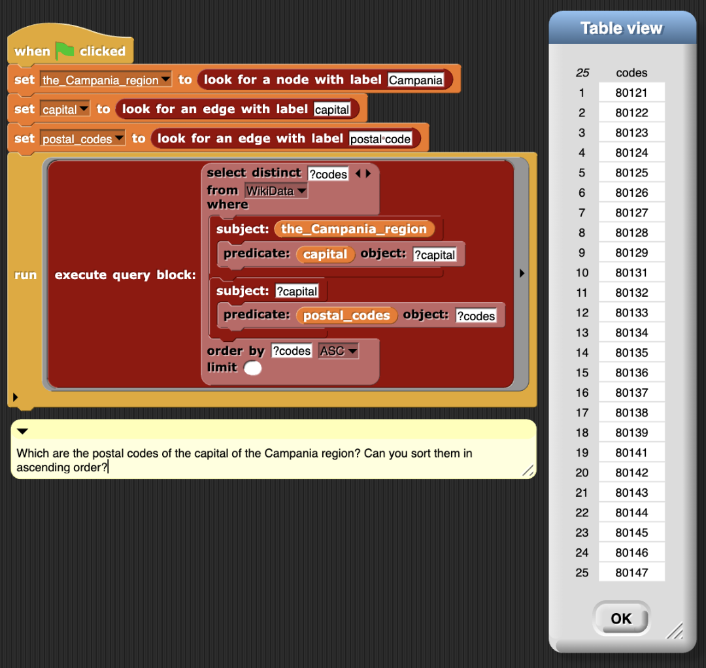
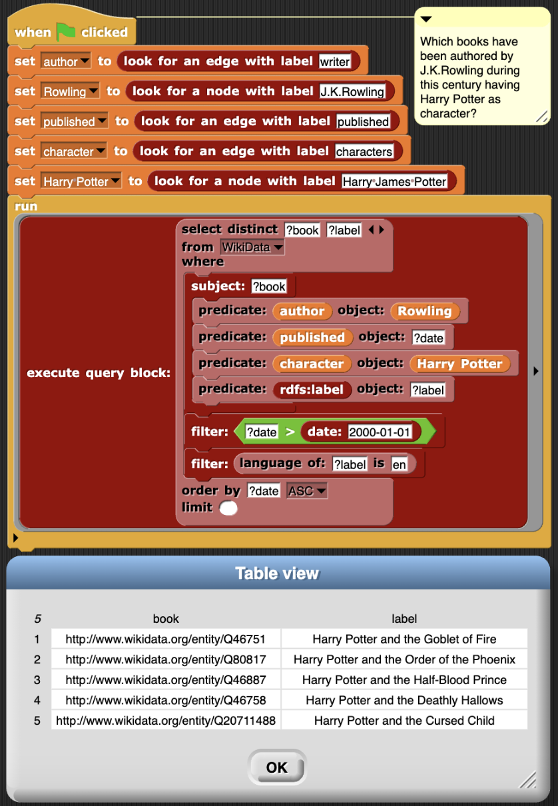

This folder contains
- exemplary projects in xml format that can be imported in https://anonymous.4open.science/w/Snap-10CA/ and directly executed from there 
- screenshots showing the SPARQL query authored via SPARQLSnap!, returned results as data table, and a comment containing the corresponding query in natural language.

More in detail, examples are listed below:
- The following image shows an example of object retrieval. Hence, SUBJECT and PREDICATE are known, and the SELECT query is interested in retrieving the corresponding OBJECT. The examplary query retrieves the BOILING POINT of the WATER. 
 

- The following image shows an example of path traversal where we are interested in retrieving the object of a two hop query. More in detail, the examplary query retrieves the POPULATION of the CAPITAL of ITALY.

- The following image shows an example of path traversal where we are interested in retrieving the objects of a two hop query. More in detail, the examplary query retrieves the POSTAL CODES of the CAPITAL of the CAMPANIA region. The query sorts results by codes.

- The following image combines path traversal, filtering, and sorting by retrieving books authored by J.K.Rowling in this century having Harry Potter as character and sort results by publication date.
 
